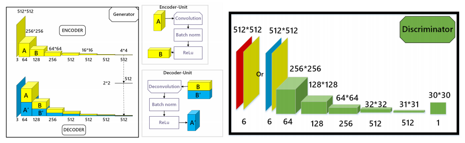
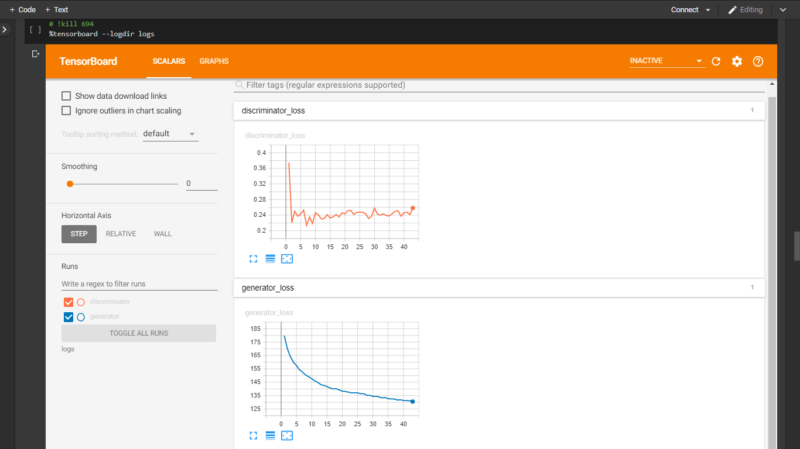
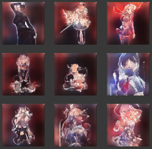
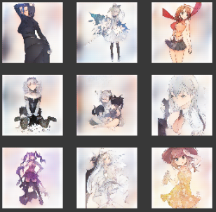
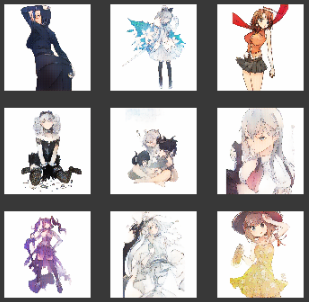
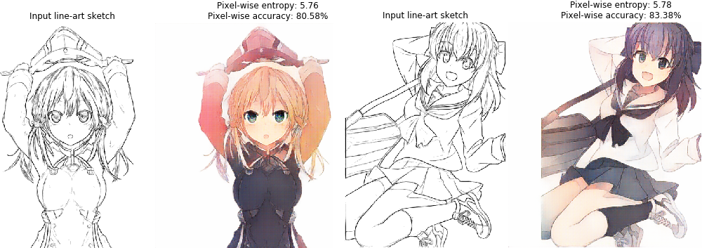

# Sketch2Color-anime-translation:
Given a simple line-art anime sketch the model should output a decent colored anime image using Conditional-Generative Adversarial Networks (C-GANs).

Implemented the anime sketch colorization using the reference(s) paper-1 below.

* Dataset: [Anime sketch colorization pair](https://www.kaggle.com/ktaebum/anime-sketch-colorization-pair)
* Blog on: [Towards Data Science](https://towardsdatascience.com/sketch-to-color-anime-translation-using-generative-adversarial-networks-gans-8f4f69594aeb?source=friends_link&sk=15df1b03e8ffc60eaa82bb34114c242a)

**References**:

[1] https://arxiv.org/abs/1705.01908

[2] https://machinelearningmastery.com

[3] https://github.com/soumith/ganhacks

# Prerequisites:
- Miniconda
- Tensorflow 1.15
- NVIDIA GPU (8G memory) + CUDA cuDNN

# Installation:
- Clone this repo:
```bash
> git clone https://github.com/sanjay235/Sketch2Color-anime-translation.git
> cd Sketch2Color-anime-translation
```
- Install Miniconda from https://docs.conda.io/en/latest/miniconda.html
- Install Tensorflow and dependencies from https://www.tensorflow.org/install/
- Open the anaconda prompt and create a new environment with **environment.yml** file,
  the first line of the yml file sets the new environment's name:
```bash
> conda env create -f environment.yml
```
- Then activate the environment created and launch the jupyter:
```bash
> conda activate Sketch2ColorAnimeTranslation
> jupyter notebook
``` 
# Dataset:
- Download and extract the dataset to current directory.
- Open an another anaconda prompt with same environment activated and run the pre-processing script as below,
```bash
> python DataPreprocessing.py
```

# Training and testing:
- For the training process refer the `Sketch2Color_Anime.ipynb` notebook.
- For the evaluation on test data refer the `final.ipynb` notebook.

# C-GAN Architecture:


# Tensorboard logs:


# In progress training results:
**At epoch 30,**



**At epoch 40,**



**At epoch 43,**



# Prediction on test sketches:




# Contribute:
Correction & Contribution are always welcome!! 😃
